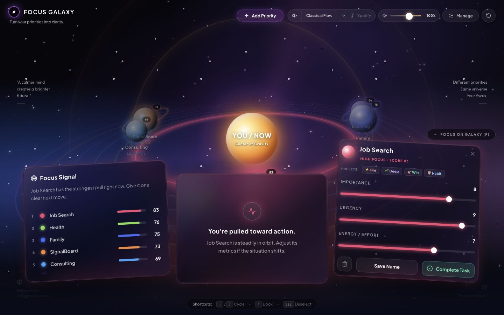
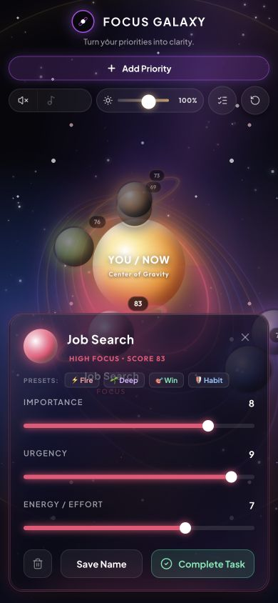

# Focus Galaxy

Focus Galaxy is a local-first focus and priority map that turns tasks into an interactive galaxy and shows what deserves attention now.

## Product screenshots



*Captured from the running app with its six seeded sample priorities.*



*The same live app and sample priorities at a phone-sized viewport.*

## What it does

- Maps importance, urgency, and effort to visual position, size, and activity.
- Shows a deterministic Focus Score from 0–100 with a short rule-based interpretation.
- Lets you add, edit, remove, reset, and locally persist priorities.
- Starts with six seeded priorities so the product is useful immediately.
- Runs without an API key or external service.

The MVP is intentionally frontend-only: priority data is stored in the browser with `localStorage`. The repository is a pnpm workspace that also contains the supporting API and database packages for future extension.

## Stack

- React, Vite, and TypeScript
- Tailwind CSS and Framer Motion
- Express 5, PostgreSQL, and Drizzle ORM in the workspace infrastructure
- Zod validation and generated API contracts

## Run locally

Requirements: Node.js 24+ and pnpm.

```bash
git clone https://github.com/amu3dev/focus-galaxy.git
cd focus-galaxy
pnpm install
pnpm --filter @workspace/focus-galaxy run dev
```

Useful checks:

```bash
pnpm run typecheck
pnpm run build
```

## Deploy on Cloudflare Workers

The app deploys as static assets on a Cloudflare Worker. The GitHub Actions workflow deploys `main` when the app or deployment files change. Add a Cloudflare API token with the `Edit Cloudflare Workers` permission as the repository secret `CLOUDFLARE_API_TOKEN`, scoped to the account that owns the Worker. See [Cloudflare's GitHub Actions setup](https://developers.cloudflare.com/workers/ci-cd/external-cicd/github-actions/).

For a manual deploy, authenticate Wrangler to Cloudflare and run:

```bash
pnpm run deploy:focus-galaxy
```

Live site: <https://focus-galaxy.amu3dev.workers.dev>

The Worker uses the `workers.dev` subdomain and serves the built single-page app from `artifacts/focus-galaxy/dist/public`.

## Optional Spotify playback

Spotify playback is opt-in. Create a Spotify Developer app, add the exact URL where Focus Galaxy runs to its Redirect URI allowlist, then set the public client ID in `.env.local`:

```bash
VITE_SPOTIFY_CLIENT_ID=your_client_id
```

The app uses Authorization Code with PKCE, so no Spotify client secret belongs in the frontend. A user must explicitly authorize the app, and browser playback requires Spotify Premium; the built-in generated focus music remains available when Spotify is not configured or supported.

## Project structure

```text
artifacts/focus-galaxy/       # Focus Galaxy web app
artifacts/focus-galaxy/src/   # UI, scoring, persistence, and interactions
scripts/                      # Workspace scripts and checks
```

## Product decisions

- A rule-based score keeps the MVP explainable and predictable.
- The visual map makes trade-offs visible instead of hiding them in a list.
- Local persistence keeps the first-use experience simple and private.
